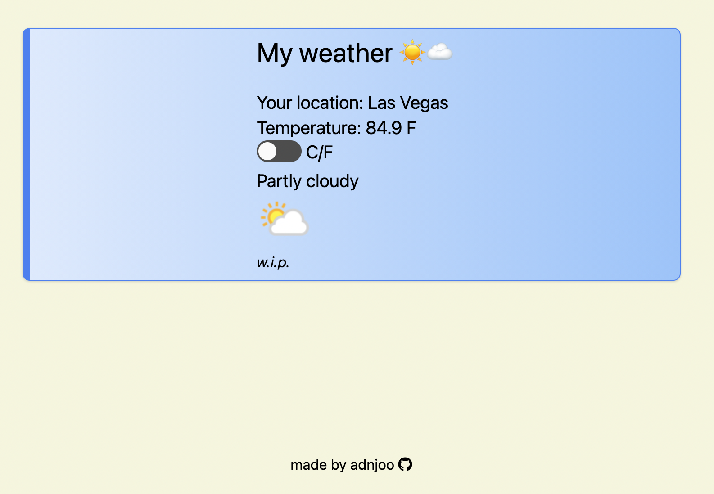

## react weather app

> this app helps you tell the weather in your local area.

<a href='https://adnjoo.github.io/weather-app/'></a>

## instructions
```
$ git clone https://github.com/adnjoo/weather-app
$ cd weather-app/
$ npm install
$ npm run start
```

## technology

Framework: react.js

Libraries: tailwind, axios, [react-switch](https://www.npmjs.com/package/react-switch), [font-awesome](https://fontawesome.com/), [react-helmet](https://github.com/nfl/react-helmet), [react-favicon](https://www.npmjs.com/package/react-favicon)

APIs: [abstractapi](https://www.abstractapi.com/), [weatherapi](https://www.weatherapi.com/)


## react-gh-pages

command to gen prod build of app, and deploy to gh-pages
```sh
$ npm run deploy
```
