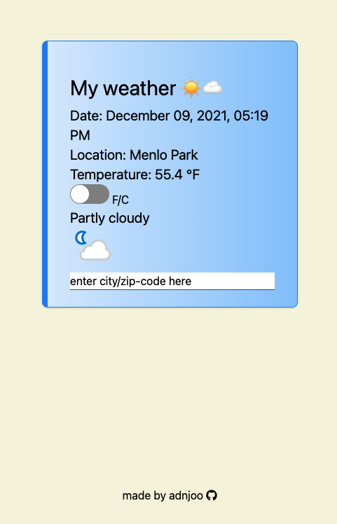

## React Weather

> This app helps you find the weather.

<a href='https://adnjoo.github.io/React-Weather/'></a>

## Technology:

* React.js
* Tailwind 
* Axios 
* [React Switch](https://www.npmjs.com/package/react-switch) 
* [Font Awesome](https://fontawesome.com/) 
* [React Helmet](https://github.com/nfl/react-helmet) 
* [React Favicon](https://www.npmjs.com/package/react-favicon)
* React-GH-Pages

APIs: 
* [Abstract API](https://www.abstractapi.com/) 
* [Weather API](https://www.weatherapi.com/)

## Instructions:
```
$ git clone https://github.com/adnjoo/React-Weather
$ cd React-Weather/
$ npm install
$ npm run start
```

## Build to GitHub Pages:
```
$ npm run build
```
